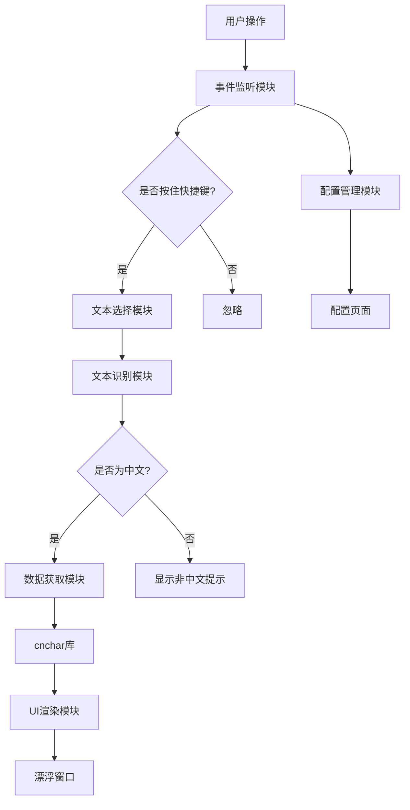

# 识字释文 (HanziWhisper) 油猴插件设计文档

## 项目概述

**中文名称**: 识字释文  
**英文名称**: HanziWhisper  
**类型**: 油猴插件 (Tampermonkey/Greasemonkey)  
**核心功能**: 按住快捷键选中汉字后，弹出漂浮窗口显示汉字的读音、解释等信息

---

## 一、核心需求

### 1.1 基础功能
- 按住Alt键选中汉字后，弹出漂浮窗口
- 显示汉字的拼音、笔画、部首、解释等信息
- 支持单字和多字查询，如果选中内容太多（如超出20字），则提示内容太多，请缩小范围
- 非中文内容提示"选择的内容非中文，本插件暂只支持中文，"

### 1.2 依赖库
- 使用 [cnchar](https://github.com/theajack/cnchar) 库
- CDN地址: `https://fastly.jsdelivr.net/npm/cnchar-all/cnchar.all.min.js`

### 1.3 配置功能
- 可视化配置页面
- 支持修改快捷键
- 支持个性化配置

### 1.4 兼容性
- 适配所有中文网站
- 支持主流浏览器（Chrome、Firefox、Edge等）

---

## 二、系统架构

### 2.1 整体架构图



### 2.2 模块划分

| 模块名称 | 功能描述 |
|---------|---------|
| 事件监听模块 | 监听键盘事件和文本选择事件 |
| 文本选择模块 | 获取用户选中的文本 |
| 文本识别模块 | 判断选中文本是否为中文 |
| 数据获取模块 | 调用cnchar库获取汉字信息 |
| UI渲染模块 | 渲染漂浮窗口和配置页面 |
| 配置管理模块 | 管理用户配置（使用GM_setValue/GM_getValue） |
| 样式管理模块 | 管理插件样式 |

---

## 三、核心功能设计

### 3.1 快捷键系统

**默认快捷键**: Alt键

**支持的快捷键配置**:
- 单键: Alt, Ctrl, Shift, Meta
- 组合键: Alt+Ctrl, Alt+Shift, Ctrl+Shift等

**快捷键检测逻辑**:
```javascript
// 伪代码
document.addEventListener('keydown', (e) => {
    if (e.key === config.hotkey) {
        isHotkeyPressed = true;
    }
});

document.addEventListener('keyup', (e) => {
    if (e.key === config.hotkey) {
        isHotkeyPressed = false;
    }
});

document.addEventListener('mouseup', (e) => {
    if (isHotkeyPressed) {
        const selection = window.getSelection().toString();
        if (selection) {
            showPopup(selection);
        }
    }
});
```

### 3.2 中文识别

**识别规则**:
- 使用正则表达式匹配中文字符: `/[\u4e00-\u9fa5]/`
- 支持简体中文和繁体中文
- 混合文本（中英文混合）只提取中文部分

**识别逻辑**:
```javascript
function isChinese(text) {
    return /[\u4e00-\u9fa5]/.test(text);
}

function extractChinese(text) {
    return text.replace(/[^\u4e00-\u9fa5]/g, '');
}
```

### 3.3 数据获取（基于cnchar）

**cnchar库提供的功能**:

| 功能 | API | 说明 |
|-----|-----|------|
| 拼音 | `cnchar.spell(text)` | 获取拼音 |
| 笔画 | `cnchar.stroke(text)` | 获取笔画数 |
| 笔顺 | `cnchar.spell(text, 'order')` | 获取笔顺 |
| 部首 | `cnchar.radical(text)` | 获取部首 |
| 解释 | `cnchar.explain(text)` | 获取解释 |
| 繁简转换 | `cnchar.convert(text, 'simple'/'trad')` | 繁简转换 |

**数据获取流程**:
```javascript
function getHanziInfo(text) {
    return {
        text: text,
        pinyin: cnchar.spell(text),
        stroke: cnchar.stroke(text),
        radical: cnchar.radical(text),
        explain: cnchar.explain(text),
        trad: cnchar.convert(text, 'trad')
    };
}
```

### 3.4 漂浮窗口设计

**窗口特性**:
- 跟随鼠标位置显示
- 支持拖拽移动
- 点击外部区域关闭
- 支持固定/取消固定
- 响应式设计，适配不同屏幕

**窗口内容结构**:
```
┌─────────────────────────────┐
│  汉字  [固定] [关闭]         │
├─────────────────────────────┤
│  拼音: hàn zì               │
│  笔画: 5画                  │
│  部首: 氵                   │
│  繁体: 漢字                 │
├─────────────────────────────┤
│  解释:                      │
│  记录语言的符号...          │
└─────────────────────────────┘
```

---

## 四、配置页面设计

### 4.1 配置页面入口

**打开方式**:
- 方式1: 在漂浮窗口中添加"设置"按钮
- 方式2: 浏览器右键菜单（使用GM_registerMenuCommand）
- 方式3: 快捷键（如 Ctrl+Shift+H）

### 4.2 配置项设计

| 配置项 | 类型 | 默认值 | 说明 |
|-------|------|--------|------|
| 快捷键 | 下拉选择 | Alt | 选择触发快捷键 |
| 窗口位置 | 单选 | 跟随鼠标 | 跟随鼠标/固定位置 |
| 窗口主题 | 下拉选择 | 浅色 | 浅色/深色/跟随系统 |
| 显示拼音 | 开关 | 开启 | 是否显示拼音 |
| 显示笔画 | 开关 | 开启 | 是否显示笔画 |
| 显示部首 | 开关 | 开启 | 是否显示部首 |
| 显示繁体 | 开关 | 开启 | 是否显示繁体 |
| 显示解释 | 开关 | 开启 | 是否显示解释 |
| 窗口宽度 | 滑块 | 300px | 调整窗口宽度 |
| 字体大小 | 滑块 | 14px | 调整字体大小 |
| 自动关闭 | 开关 | 开启 | 点击外部自动关闭 |
| 关闭延迟 | 数字输入 | 200ms | 关闭延迟时间 |

### 4.3 配置页面UI结构

```
┌─────────────────────────────────────┐
│  识字释文 - 设置                     │
├─────────────────────────────────────┤
│  快捷键设置                          │
│  ○ Alt  ○ Ctrl  ○ Shift  ○ Meta    │
│                                      │
│  显示内容                            │
│  ☑ 显示拼音  ☑ 显示笔画             │
│  ☑ 显示部首  ☑ 显示繁体             │
│  ☑ 显示解释                          │
│                                      │
│  外观设置                            │
│  窗口主题: [浅色 ▼]                  │
│  窗口宽度: [300px] ——————            │
│  字体大小: [14px] ——————             │
│                                      │
│  行为设置                            │
│  ☑ 点击外部自动关闭                  │
│  关闭延迟: [200] ms                  │
│                                      │
│  [保存] [重置] [取消]                │
└─────────────────────────────────────┘
```

---

## 五、扩展功能设计

### 5.1 历史记录

**功能描述**:
- 记录用户查询过的汉字
- 支持查看历史记录
- 支持清空历史记录
- 支持导出历史记录

**数据结构**:
```javascript
{
    id: 1,
    text: '汉字',
    pinyin: 'hàn zì',
    timestamp: 1234567890,
    url: 'https://example.com'
}
```

### 5.2 收藏功能

**功能描述**:
- 支持收藏常用汉字
- 支持分类管理收藏
- 支持导出收藏列表

### 5.3 成语查询

**功能描述**:
- 选中成语后显示成语解释
- 显示成语出处、例句
- 支持成语接龙

### 5.4 诗词查询

**功能描述**:
- 选中诗句后显示诗词全文
- 显示作者、朝代、赏析
- 支持诗词搜索

### 5.5 语音朗读

**功能描述**:
- 使用浏览器Web Speech API
- 支持朗读汉字拼音
- 支持调节语速和音调

### 5.6 笔顺动画

**功能描述**:
- 显示汉字笔顺动画
- 支持暂停/播放
- 支持调节动画速度

### 5.7 多语言支持

**功能描述**:
- 支持界面多语言切换
- 支持中文、英文界面

### 5.8 数据缓存

**功能描述**:
- 缓存已查询的汉字数据
- 减少重复查询
- 支持清除缓存

---

## 六、技术实现细节

### 6.1 文件结构

```
HanziWhisper/
├── HanziWhisper.user.js          # 主脚本文件
├── styles/
│   ├── popup.css                 # 漂浮窗口样式
│   ├── settings.css              # 配置页面样式
│   └── themes/
│       ├── light.css             # 浅色主题
│       └── dark.css              # 深色主题
├── scripts/
│   ├── core/
│   │   ├── event-listener.js     # 事件监听
│   │   ├── text-recognizer.js    # 文本识别
│   │   ├── data-fetcher.js       # 数据获取
│   │   └── config-manager.js     # 配置管理
│   ├── ui/
│   │   ├── popup-renderer.js     # 漂浮窗口渲染
│   │   └── settings-renderer.js  # 配置页面渲染
│   └── utils/
│       ├── storage.js            # 存储工具
│       ├── history.js            # 历史记录
│       └── favorites.js          # 收藏功能
├── README.md                     # 项目说明
└── CHANGELOG.md                  # 更新日志
```

### 6.2 油猴脚本元数据

```javascript
// ==UserScript==
// @name         识字释文
// @name:zh-CN   识字释文
// @name:en      HanziWhisper
// @namespace    http://tampermonkey.net/
// @version      1.0.0
// @description  按住Alt键选中汉字后，弹出漂浮窗口显示汉字的读音、解释等信息
// @description:zh-CN  按住Alt键选中汉字后，弹出漂浮窗口显示汉字的读音、解释等信息
// @description:en  Hold Alt key and select Chinese characters to show pronunciation and explanation
// @author       YourName
// @match        *://*/*
// @grant        GM_setValue
// @grant        GM_getValue
// @grant        GM_deleteValue
// @grant        GM_registerMenuCommand
// @grant        GM_addStyle
// @require      https://fastly.jsdelivr.net/npm/cnchar-all/cnchar.all.min.js
// @connect      *
// @run-at       document-end
// ==/UserScript==
```

### 6.3 样式隔离

**问题**: 油猴插件样式可能与页面样式冲突

**解决方案**:
1. 使用唯一的CSS类名前缀（如 `hw-`）
2. 使用Shadow DOM隔离样式
3. 使用CSS变量管理主题

```javascript
// 使用Shadow DOM
const shadowRoot = popupElement.attachShadow({ mode: 'open' });
shadowRoot.innerHTML = `
    <style>
        /* 样式代码 */
    </style>
    <div class="hw-popup">...</div>
`;
```

### 6.4 性能优化

**优化策略**:
1. 延迟加载cnchar库
2. 数据缓存
3. 防抖处理（debounce）
4. 虚拟滚动（历史记录列表）

```javascript
// 防抖处理
function debounce(func, wait) {
    let timeout;
    return function(...args) {
        clearTimeout(timeout);
        timeout = setTimeout(() => func.apply(this, args), wait);
    };
}

const debouncedShowPopup = debounce(showPopup, 100);
```

### 6.5 错误处理

**错误类型**:
1. cnchar库加载失败
2. 网络请求失败
3. 数据解析失败
4. 用户配置错误

**处理策略**:
```javascript
try {
    const info = getHanziInfo(text);
    renderPopup(info);
} catch (error) {
    console.error('HanziWhisper Error:', error);
    showErrorPopup('获取汉字信息失败，请稍后重试');
}
```

---

## 七、开发计划

### 7.1 第一阶段（MVP）

- [ ] 基础框架搭建
- [ ] 事件监听模块
- [ ] 文本识别模块
- [ ] 数据获取模块（拼音、笔画、部首、解释）
- [ ] 基础漂浮窗口UI
- [ ] 非中文提示

### 7.2 第二阶段（配置功能）

- [ ] 配置管理模块
- [ ] 配置页面UI
- [ ] 快捷键配置
- [ ] 显示内容配置
- [ ] 外观配置

### 7.3 第三阶段（扩展功能）

- [ ] 历史记录功能
- [ ] 收藏功能
- [ ] 语音朗读
- [ ] 笔顺动画
- [ ] 多语言支持

### 7.4 第四阶段（优化完善）

- [ ] 性能优化
- [ ] 样式优化
- [ ] 错误处理完善
- [ ] 文档完善
- [ ] 测试

---

## 八、测试计划

### 8.1 功能测试

| 测试项 | 测试内容 |
|-------|---------|
| 快捷键测试 | 测试各种快捷键组合 |
| 中文识别 | 测试单字、多字、混合文本 |
| 数据显示 | 测试拼音、笔画、部首、解释显示 |
| 配置功能 | 测试各项配置保存和加载 |
| 兼容性测试 | 测试不同网站兼容性 |

### 8.2 浏览器兼容性测试

| 浏览器 | 版本 |
|-------|------|
| Chrome | 最新版 |
| Firefox | 最新版 |
| Edge | 最新版 |
| Safari | 最新版 |

### 8.3 性能测试

| 测试项 | 目标 |
|-------|------|
| 响应时间 | < 100ms |
| 内存占用 | < 10MB |
| CPU占用 | < 5% |

---

## 九、发布计划

### 9.1 发布渠道

1. Greasy Fork
2. Tampermonkey.net
3. GitHub Releases

### 9.2 版本管理

遵循语义化版本规范（Semantic Versioning）:
- 主版本号: 不兼容的API修改
- 次版本号: 向下兼容的功能性新增
- 修订号: 向下兼容的问题修正

### 9.3 更新日志

使用 [Keep a Changelog](https://keepachangelog.com/) 格式

---

## 十、后续扩展方向

1. **AI增强**: 集成AI提供更智能的解释和例句
2. **OCR功能**: 支持图片中的汉字识别
3. **手写输入**: 支持手写输入查询汉字
4. **离线模式**: 支持离线使用（需要下载完整数据）
5. **插件生态**: 支持第三方插件扩展功能
6. **云端同步**: 支持配置和历史记录云端同步
7. **社交功能**: 支持分享和评论
8. **学习模式**: 提供汉字学习游戏和测试

---

## 附录

### A. cnchar API 参考

详见: https://github.com/theajack/cnchar

### B. 油猴 API 参考

详见: https://www.tampermonkey.net/documentation.php

### C. 相关资源

- [油猴脚本开发指南](https://www.tampermonkey.net/documentation.php)
- [cnchar官方文档](https://github.com/theajack/cnchar)
- [Greasy Fork发布指南](https://greasyfork.org/help/adding-a-script)
